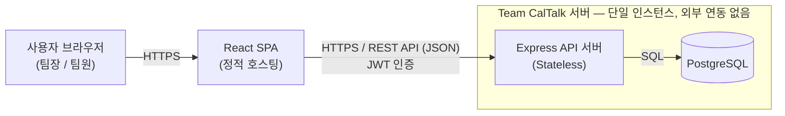
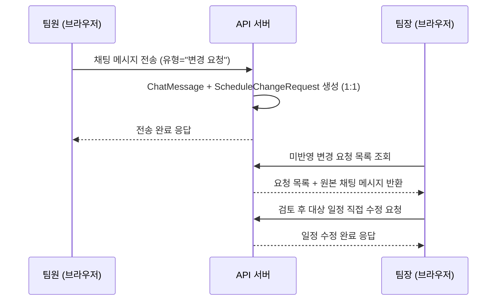
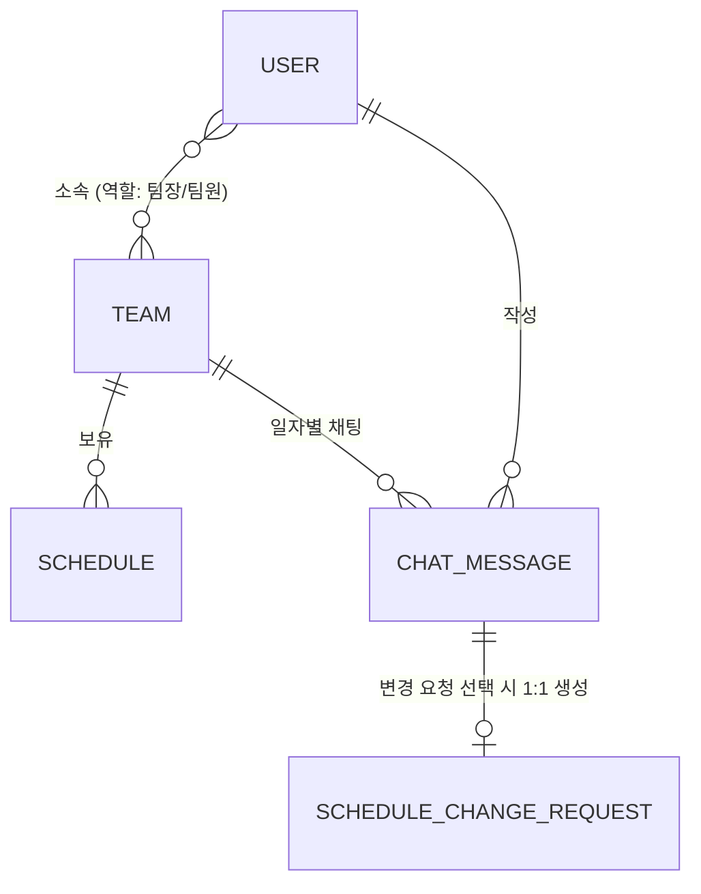

# Team CalTalk 기술 아키텍처 다이어그램

## 0. 문서 메타데이터

| 항목 | 내용 |
|---|---|
| 문서명 | Team CalTalk 기술 아키텍처 다이어그램 |
| 버전 | v0.1 |
| 상태 | Draft (초안) |
| 최종 수정일 | 2026-07-22 |
| 작성/관리 | Team CalTalk 아키텍처 담당 |
| 근거 문서 | `1-domain-definition.md` (v0.2), `2-PRD.md` (v0.1, 특히 §7), `3-user-scenarios.md` (v0.1), `4-project-structure-principles.md` (v0.1) |

> 본 문서는 선행 문서에서 이미 확정한 기술 스택(React + Node.js/Express + PostgreSQL)·제약(1인 개발·5일 MVP·단일 인스턴스·외부 연동 없음)·레이어링 원칙을 그대로 계승하며, 세부 구현(라우트/컨트롤러/서비스/모델, 테이블 컬럼 등)은 이미 `4-project-structure-principles.md`가 다루므로 여기서 반복하지 않는다. 이 문서는 **시스템이 어떻게 생겼는지를 한눈에 보여주는 최소한의 다이어그램**만 제공한다.

---

## 1. 시스템 구성도

브라우저에서 React SPA를 서비스하고, Express API 서버 한 대가 PostgreSQL 한 대와 통신하는 단일 인스턴스 구성이다. 외부 서비스 연동은 없다.

---

## 2. 요청 흐름도 — 일정 변경 요청 (핵심 차별점)

팀원이 채팅에서 "변경 요청"을 명시적으로 선택해 전송하면 API 서버가 ChatMessage와 ScheduleChangeRequest를 함께 생성하고, 팀장은 이를 검토한 뒤 일정을 직접 수정한다(승인/반려 상태 없음, `1-domain-definition.md` §1.2·`3-user-scenarios.md` SC-06/SC-07 참고).

---

## 3. 데이터 개념 관계도

`1-domain-definition.md` §4의 핵심 개념을 엔티티명과 관계선만으로 단순화했다. ChatRoom은 별도 테이블이 아니라 "팀 + 날짜" 조합으로만 논리적으로 표현되므로(`4-project-structure-principles.md` §3.1.1과 일치) 엔티티로 그리지 않는다.

